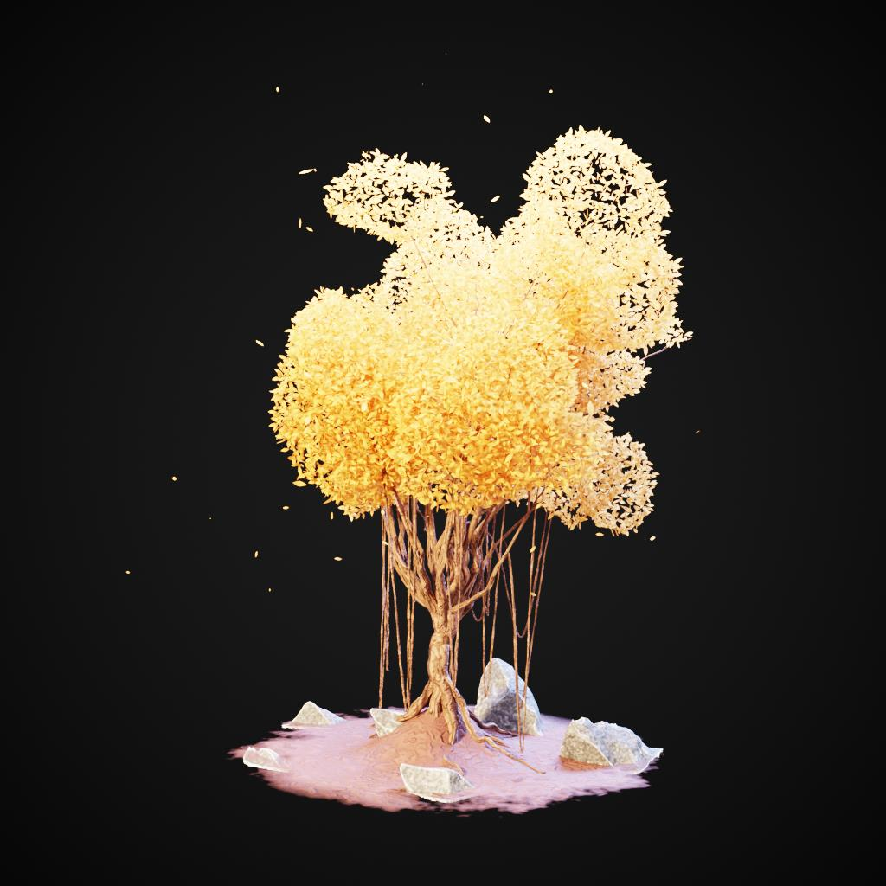
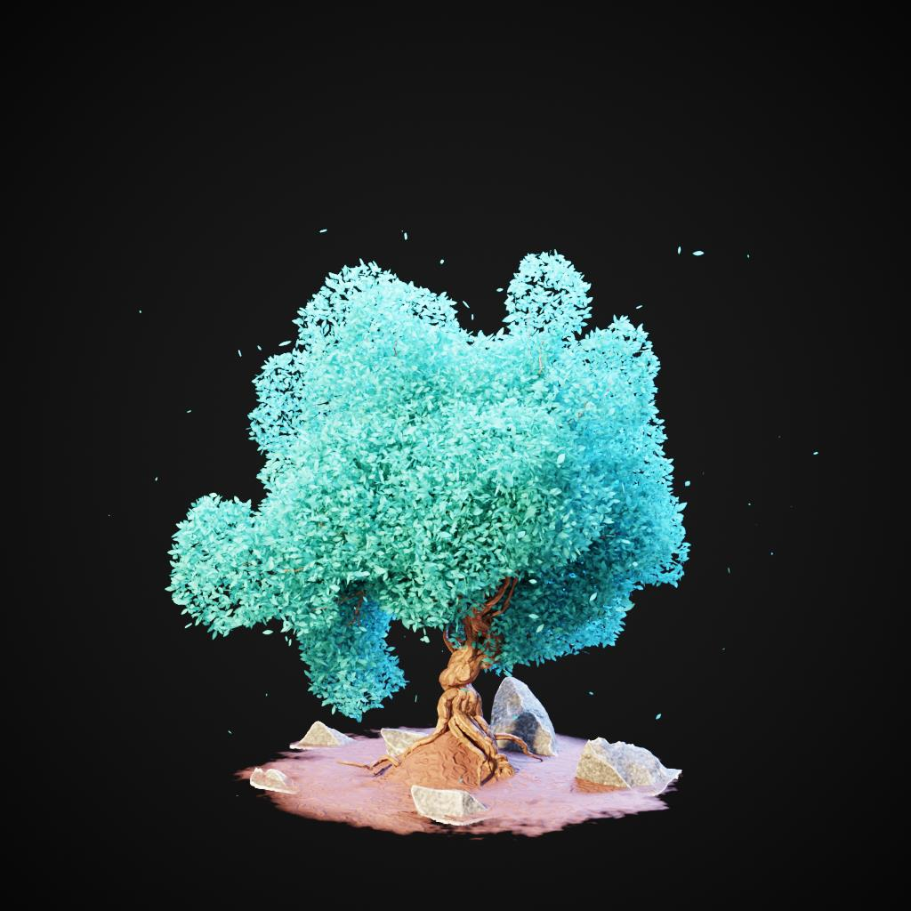
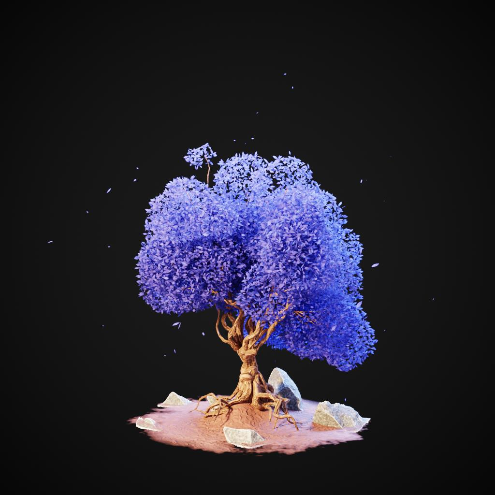
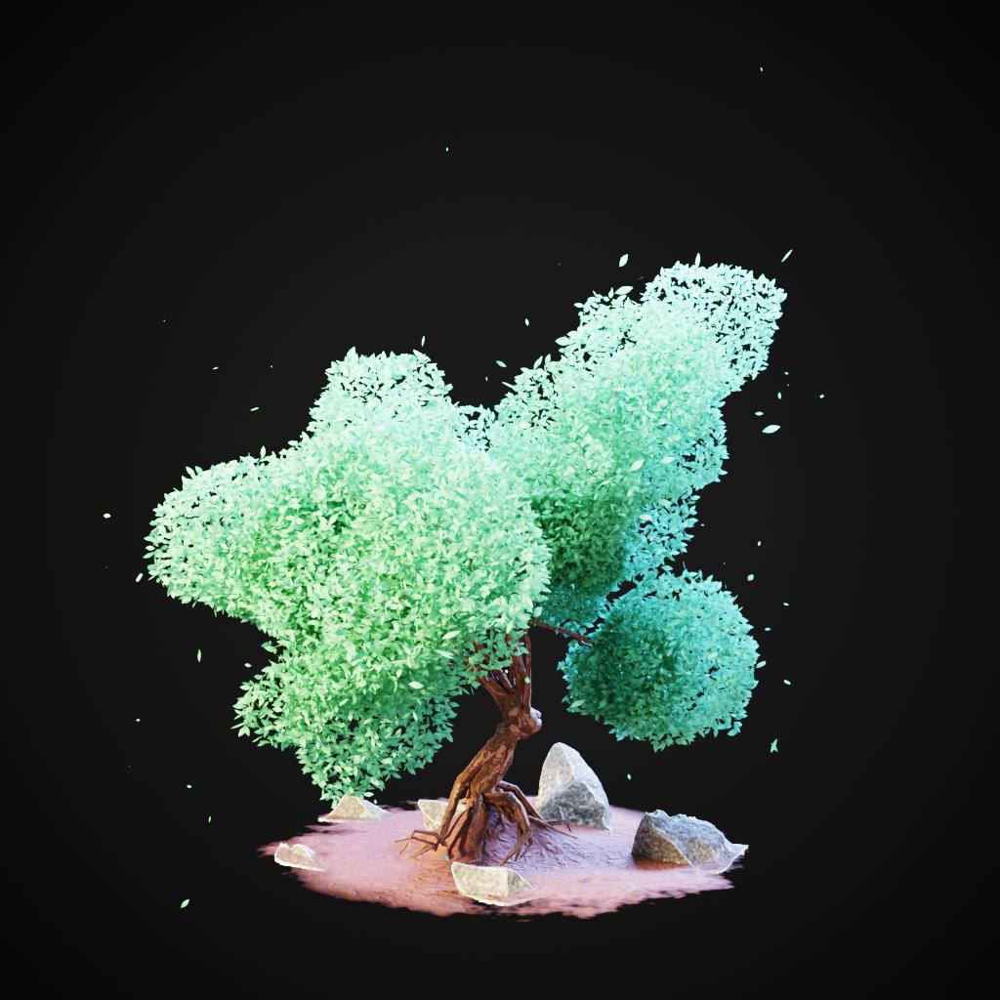

# LILYTREE EXAMPLES

This page contains a collection of examples of generated LilyTrees. Each example includes the Ethereum address used to generate the tree, a breakdown of the address, and the parameters used to generate the tree.

## Examples

| Ethereum Address / Result | Breakdown | Parameters |
| --- | --- | --- |
|  | <pre>Index  Hex Pair    Decimal [00]   [E4]   ->   228 [01]   [22]   ->    34 [02]   [72]   ->   114 [03]   [95]   ->   149 [04]   [13]   ->    19 [05]   [e2]   ->   226 [06]   [dB]   ->   219 [07]   [16]   ->    22 [08]   [5D]   ->    93 [09]   [2f]   ->    47 [10]   [01]   ->     1 [11]   [7C]   ->   124 [12]   [Ea]   ->   234 [13]   [76]   ->   118 [14]   [1F]   ->    31 [15]   [C5]   ->   197 [16]   [55]   ->    85 [17]   [CF]   ->   207 [18]   [22]   ->    34 [19]   [0A]   ->    10</pre> | <pre>Parameter               : Value [Base Count]            : 22 [Tree Seed]             : 133 [Trunk Resolution]      : 118 [Resolution]            : 40 [Tree Distortion]       : 0.075 [Trunk Noise Y]         : 7.725 [Trunk Noise Z]         : 7.176 [Split Angle]           : 3.882 [Branch Length]         : 1.729 [Branch Count]          : 5 [Branch Seed]           : 3 [Leaves Seed]           : 486 [Leaves Color R]        : 0.918 [Leaves Color G]        : 0.463 [Leaves Color B]        : 0.122 [Leaves Noise Y]        : 5.451 [Leaves Noise Z]        : -3.333 [Vines Toggle]          : True [Vine Gravity]          : -4.333 [Vine Seed]             : 39</pre> |
|  | <pre>Index  Hex Pair    Decimal [00]   [c9]   ->   201 [01]   [37]   ->    55 [02]   [c7]   ->   199 [03]   [45]   ->    69 [04]   [dF]   ->   223 [05]   [3D]   ->    61 [06]   [20]   ->    32 [07]   [62]   ->    98 [08]   [02]   ->     2 [09]   [fd]   ->   253 [10]   [E1]   ->   225 [11]   [58]   ->    88 [12]   [17]   ->    23 [13]   [7C]   ->   124 [14]   [79]   ->   121 [15]   [95]   ->   149 [16]   [7D]   ->   125 [17]   [26]   ->    38 [18]   [fb]   ->   251 [19]   [CC]   ->   204</pre> | <pre>Parameter               : Value [Base Count]            : 20 [Tree Seed]             : 215 [Trunk Resolution]      : 201 [Resolution]            : 23 [Tree Distortion]       : 0.875 [Trunk Noise Y]         : -5.216 [Trunk Noise Z]         : -7.490 [Split Angle]           : 17.294 [Branch Length]         : 1.016 [Branch Count]          : 14 [Branch Seed]           : 882 [Leaves Seed]           : 345 [Leaves Color R]        : 0.090 [Leaves Color G]        : 0.486 [Leaves Color B]        : 0.475 [Leaves Noise Y]        : 1.686 [Leaves Noise Z]        : -0.196 [Vines Toggle]          : False [Vine Gravity]          : -0.078 [Vine Seed]             : 800</pre> |
|  | <pre>Index  Hex Pair    Decimal [00]   [Bb]   ->   187 [01]   [0f]   ->    15 [02]   [ed]   ->   237 [03]   [78]   ->   120 [04]   [Dd]   ->   221 [05]   [d0]   ->   208 [06]   [40]   ->    64 [07]   [1D]   ->    29 [08]   [0E]   ->    14 [09]   [76]   ->   118 [10]   [55]   ->    85 [11]   [6E]   ->   110 [12]   [15]   ->    21 [13]   [15]   ->    21 [14]   [6F]   ->   111 [15]   [e8]   ->   232 [16]   [8f]   ->   143 [17]   [18]   ->    24 [18]   [f1]   ->   241 [19]   [e4]   ->   228</pre> | <pre>Parameter               : Value [Base Count]            : 19 [Tree Seed]             : 58 [Trunk Resolution]      : 238 [Resolution]            : 34 [Tree Distortion]       : 0.867 [Trunk Noise Y]         : 6.314 [Trunk Noise Z]         : -4.980 [Split Angle]           : 5.118 [Branch Length]         : 1.110 [Branch Count]          : 8 [Branch Seed]           : 333 [Leaves Seed]           : 431 [Leaves Color R]        : 0.082 [Leaves Color G]        : 0.082 [Leaves Color B]        : 0.435 [Leaves Noise Y]        : 8.196 [Leaves Noise Z]        : 1.216 [Vines Toggle]          : False [Vine Gravity]          : -0.275 [Vine Seed]             : 894</pre> |
|  | <pre>Index  Hex Pair    Decimal [00]   [92]   ->   146 [01]   [39]   ->    57 [02]   [73]   ->   115 [03]   [99]   ->   153 [04]   [3c]   ->    60 [05]   [7a]   ->   122 [06]   [5A]   ->    90 [07]   [89]   ->   137 [08]   [2b]   ->    43 [09]   [36]   ->    54 [10]   [47]   ->    71 [11]   [E1]   ->   225 [12]   [66]   ->   102 [13]   [1d]   ->    29 [14]   [17]   ->    23 [15]   [AB]   ->   171 [16]   [0c]   ->    12 [17]   [45]   ->    69 [18]   [50]   ->    80 [19]   [2B]   ->    43</pre> | <pre>Parameter               : Value [Base Count]            : 15 [Tree Seed]             : 223 [Trunk Resolution]      : 119 [Resolution]            : 41 [Tree Distortion]       : 0.235 [Trunk Noise Y]         : -0.431 [Trunk Noise Z]         : -2.941 [Split Angle]           : 24.176 [Branch Length]         : 1.337 [Branch Count]          : 5 [Branch Seed]           : 278 [Leaves Seed]           : 882 [Leaves Color R]        : 0.400 [Leaves Color G]        : 0.114 [Leaves Color B]        : 0.090 [Leaves Noise Y]        : 3.412 [Leaves Noise Z]        : -9.059 [Vines Toggle]          : False [Vine Gravity]          : -3.431 [Vine Seed]             : 168</pre> |
|  | <pre>Index  Hex Pair    Decimal [00]   [b0]   ->   176 [01]   [79]   ->   121 [02]   [0a]   ->    10 [03]   [Ac]   ->   172 [04]   [E3]   ->   227 [05]   [29]   ->    41 [06]   [4d]   ->    77 [07]   [0e]   ->    14 [08]   [0c]   ->    12 [09]   [88]   ->   136 [10]   [92]   ->   146 [11]   [fa]   ->   250 [12]   [2B]   ->    43 [13]   [8a]   ->   138 [14]   [54]   ->    84 [15]   [17]   ->    23 [16]   [24]   ->    36 [17]   [49]   ->    73 [18]   [D8]   ->   216 [19]   [B4]   ->   180</pre> | <pre>Parameter               : Value [Base Count]            : 18 [Tree Seed]             : 474 [Trunk Resolution]      : 17 [Resolution]            : 45 [Tree Distortion]       : 0.890 [Trunk Noise Y]         : -6.784 [Trunk Noise Z]         : -3.961 [Split Angle]           : 2.471 [Branch Length]         : 1.094 [Branch Count]          : 9 [Branch Seed]           : 572 [Leaves Seed]           : 980 [Leaves Color R]        : 0.169 [Leaves Color G]        : 0.541 [Leaves Color B]        : 0.329 [Leaves Noise Y]        : -8.196 [Leaves Noise Z]        : -7.176 [Vines Toggle]          : False [Vine Gravity]          : -0.765 [Vine Seed]             : 705</pre> |